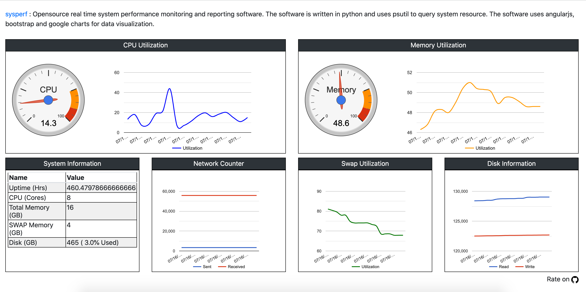

# sysperf - System Performance Dashboard
System performance dashboard showing real time cpu, memory, swap, disk and network performance metrics 

# Installing
pip install sysperf

# Running
python -m sysperf.perf

# Accessing the dashboard
http://localhost:4000

# Dashboard Sample

